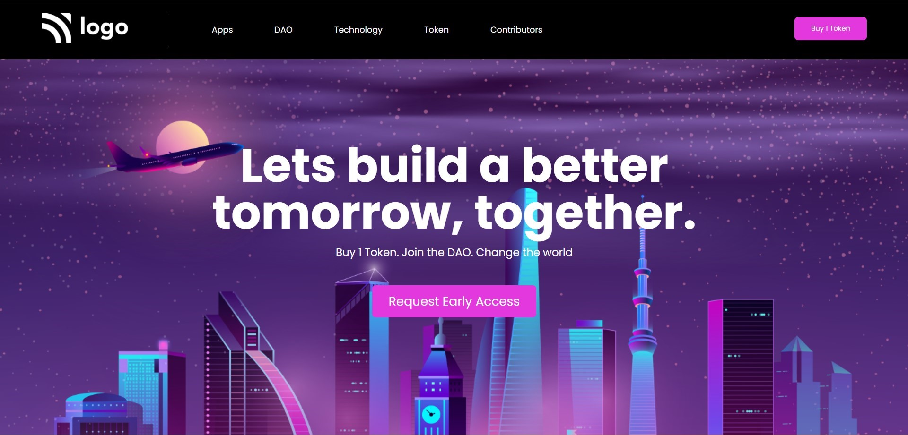

# Project 2 - with HTML and CSS

by Divesh Thakre

 

[Deployed link ](https://divesh5.netlify.app/)

## what concepts i Learned by Creating this website?

- This project was fun i used some css background-image property.
- Gained confidence on css selectors.
- learned to plan layouts.

### Time Taken For this project is around 3.5 hrs.
